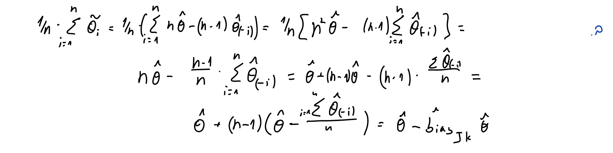

# Q1 #

## a ##

```{r,echo=FALSE}
knitr::include_graphics("1.a.png")
```

# b #

```{r,echo=FALSE}

```

# c #

```{r,echo=FALSE}
#
```

# d #

```{r,echo=FALSE}

```

# Q2 #

## a ##

```{r}
ex8dataq2 <- read.csv("~/Desktop/Ran/D year/semester b/hishov statisti/exercies/HW8/ex8data1.csv")
#View(ex8dataq2)
```

```{r}
var_cov_metrix <- var(ex8dataq2)
eigen_vec <- eigen(var_cov_metrix)
max_eigen_vec_hat <- max(eigen_vec$values)
```

```{r}
n.size <- 500
B <- 1000

result_vec <- numeric(B)

for (b in 1:B) {
  rows.sample.b <- sample.int(n = 500,size = 500,replace = TRUE)
  b_data <- ex8dataq2[rows.sample.b,]
  
  var_cov_metrix.b <- var(b_data)
  eigen_vec.b <- eigen(var_cov_metrix.b)
  max_eigen_vec_hat.b <- max(eigen_vec.b$values)
  
  result_vec[b] <- max_eigen_vec_hat.b
}
```

### Pivot 95% CI ###

```{r}

alpha.pivot <- 2*max_eigen_vec_hat - quantile(result_vec,0.975)
beta.pivot <- 2*max_eigen_vec_hat - quantile(result_vec,0.025)

c(alpha.pivot,beta.pivot)

```

### Percentiles 95% CI ###

```{r}

quantile(result_vec,c(0.025,0.975))

```

## b ##

```{r}
var.b <- var(result_vec)
bais.b <- mean(result_vec) - max_eigen_vec_hat
```

```{r,echo=FALSE}

cat(sprintf("The variance estimator is = %s", round(var.b,5)),
    sprintf("The bias estimator is = %s", round(bais.b,5)),
    sep = "\n")

```

## c ##

```{r}
result_vec_jk <- numeric(500)

for (i in 1:500) {
  jk_data.i <- ex8dataq2[-i,]
  
  var_cov_metrix.i <- var(jk_data.i)
  eigen_vec.i <- eigen(var_cov_metrix.i)
  max_eigen_vec_hat.i <- max(eigen_vec.i$values)
  
  result_vec_jk[i] <- max_eigen_vec_hat.i
}
```

```{r,echo=FALSE}

cat(sprintf("The JK variance estimator is = %s", round(var(result_vec_jk),5)),
    sprintf("The JK bias estimator is = %s", round(mean(result_vec_jk) - max_eigen_vec_hat,5)),
    sep = "\n")

```

We got a smaller variance & bias in the JK methods.

It is make sense because in JK methods we take out one sample. So, the final result does not change dramatically

# Q3 #

```{r,echo=FALSE}

```

# Q4 #

```{r}
ex8data2 <- read.csv("~/Desktop/Ran/D year/semester b/hishov statisti/exercies/HW8/ex8data2.csv")
#View(ex8data2)
```

## a ##

```{r}
k_nn <- function(xy_data,x_new,k){
  nn.index <- order(rank(x = abs(xy_data$x - x_new),ties.method = "random"))
  nn.index <- nn.index[1:k]
  
  y_new <- sum(xy_data$y[nn.index])/k
  return(y_new)
}
```


```{r}
k_options <- c(3,15,100)
PRESS_per_k <- numeric(3)

for (i in 1:3) {
  results_for_k <- numeric(1500)
  for (j in 1:1500) {
    y_new_j <- k_nn(xy_data = ex8data2[-j,],x_new = ex8data2$x[j],k = k_options[i])
    results_for_k[j] <- (ex8data2$y[j] - y_new_j)^2
  }
  
  PRESS_per_k[i] <- sum(results_for_k)
}
```

```{r,echo=FALSE}
matrix(data = PRESS_per_k,nrow = 1,ncol = 3, dimnames = list(c("PRESS_per_k"),c(3,15,100)))
```

The K that minimizing the PRESS is 15.

## b ##

```{r}
k_options <- c(3,15,100)

Q4.b.df <- data.frame(x_new = numeric(1000), k_3 = numeric(1000), k_15 = numeric(1000), k_100 = numeric(1000))


for (i in 1:1000) {
  x_new_Q4 <- runif(n = 1,min = min(ex8data2$x),max = max(ex8data2$x))
  Q4.b.df[i,1] <- x_new_Q4
  for (k in 1:3) {
    y_new_k <- k_nn(xy_data = ex8data2,x_new = x_new_Q4, k = k_options[k])
    Q4.b.df[i,k+1] <- y_new_k
  }
}
```

```{r}

Q4.b.df <- Q4.b.df[order(Q4.b.df$x),]

plot(x = Q4.b.df$x_new, y = Q4.b.df$k_3,type = 'l', xlab = "x", ylab = "y_k_nn")
legend(x = -1.1, y = .9, legend = c("k = 3", "k = 15", "k = 100"),col = c("black", "red", "blue"),lty = 1)
lines(x = Q4.b.df$x_new, y = Q4.b.df$k_15, col='red')
lines(x = Q4.b.df$x_new, y = Q4.b.df$k_100, col='blue')
```

We can see that this is a variance-bias trade off problem.

It can be seen that for k = 3 we got a very flexible model with large variance and small bias.

For k = 100 we get a model with a small variance but with a large bias.

For k = 15 we get a combination of variance and bias neither small nor large.

In this case, according to the data in section A, it seems that we will prefer the model with k = 15, 
which gives us a better combination of variance and bias than the other models.

This is consistent with the results in section A where we saw that k = 15 minimizing the PRESS.
